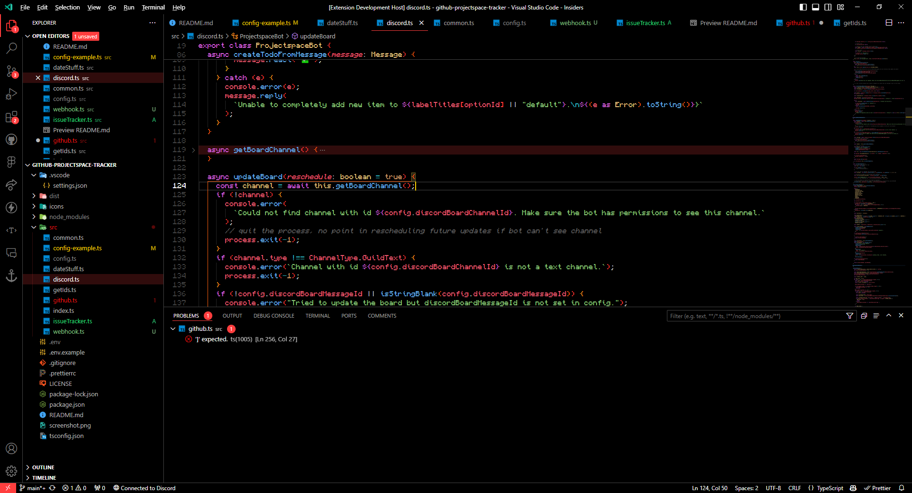

# scoria

A *really* dark theme for VSCode with hints of red, but with splashes of color to still make stuff stand out. Based off of [enenumxela's signed-dark-pro](https://github.com/enenumxela/vscode-signed-dark-pro).

Install this on your own VSCode instance by going to the Extensions panel and searching for "Scoria" by Zyplos.

This was originally made for VSCode v1.88.0 in Spring 2024. If you find anything that looks odd as a result of the latest updates, feel free to [create an issue](https://github.com/zyplos/scoria/issues).